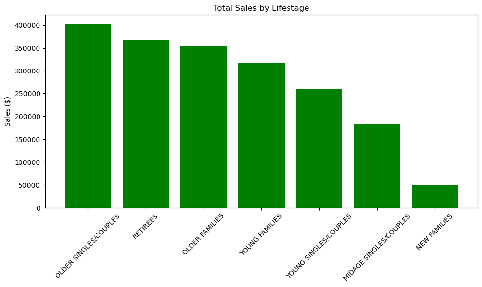

# Quantium Retail Analytics – Chips Category Review

## Overview
This project analyzes **264,835 transactions** from **72,637 customers** across **272 stores** to identify key sales drivers, customer segments, product preferences, and evaluate trial store performance.

### Key Metrics
| Metric | Value |
|----------|----------|
| Total Sales | $1.93M |
| Total Customers | 72,637 |
| Total Transactions | 264,835 |
| Units Sold | 505,122 |
| Stores Analyzed | 272 |
| Avg. Transaction Value | $7.30 |

---

## Business Objectives
- Understand sales performance and customer purchasing behavior.
- Identify high-value customer segments.
- Evaluate brand and pack-size performance.
- Measure the effectiveness of trial store initiatives.
- Provide actionable recommendations for category growth.

---

## Key points

### Customer Segments
- **Older Singles/Couples** generated the highest overall sales.
- **Retirees** and **Older Families** were major revenue contributors.
- **Mainstream customers** produced the largest share of revenue.

### Brand Performance
Top-performing brands:
1. Kettle
2. Smiths
3. Doritos
4. Pringles

### Pack Size Performance
Most popular pack sizes:
- 175g
- 150g
- 134g
- 110g
- 170g

Customers showed a strong preference for medium-sized packs (150g–175g).

---

## Visualizations

### Total Sales by Lifestage

### Sales by Customer Affluence Segment

### Top 10 Brands by Sales

### Sales by Lifestage and Affluence

---

## Trial Store Analysis

The effectiveness of trial stores was evaluated by comparing them against statistically matched control stores.

| Trial Store | Control Store | Result |
|------------|--------------|---------|
| 77 | 233 | No significant difference |
| 86 | 155 | No significant difference |
| 88 | 178 | Significant uplift during trial period |

### Store 77 vs Control Store 233

### Store 86 vs Control Store 155

### Store 88 vs Control Store 178

### Trial Sales Performance

### Trial Customer Performance

### Trial Transactions Performance

---

## Tech Stack

- Python
- Pandas
- NumPy
- Matplotlib
- Seaborn
- SciPy
- Jupyter Notebook

---

## Outcome

The analysis identified the customer segments, brands, and product sizes driving category performance while validating the impact of trial-store initiatives. Results provide clear opportunities for targeted promotions, improved inventory planning, and scalable growth strategies.