# Quantium Retail Analytics – Chips Category Review

## Overview
This project analyzes **chip category sales** for a retail client to understand **customer purchasing patterns** and evaluate the impact of a new **store layout trial**. 

I built an **end-to-end Python pipeline** to clean and standardize retail data, engineer product features, and segment customers by lifestage and spending behavior. 

The analysis revealed that while Retirees and Singles/Couples generated the highest total sales, Family segments delivered the highest value per customer due to more frequent purchases. 

Sales also showed strong seasonal peaks during the December–January holiday period. 

To assess the layout trial, I matched each trial store with a statistically comparable control store using correlation and magnitude-distance metrics, then applied hypothesis testing to isolate the trial's impact from normal variation.

Results showed significant sales growth across all trial stores, driven primarily by increased customer traffic rather than higher spending per visit.

---
---

## Key Metrics
| Metric | Value |
|----------|----------|
| Total Sales | $1.93M |
| Total Customers | 72,637 |
| Total Transactions | 264,835 |
| Units Sold | 505,122 |
| Stores Analyzed | 272 |
| Avg. Transaction Value | $7.30 |

## Business Objectives
- Understand sales performance and customer purchasing behavior.
- Identify high-value customer segments.
- Evaluate brand and pack-size performance.
- Measure the effectiveness of trial store initiatives (77, 86, 88).

---
---

## Key Points

### Customer Segments
- **Older Singles/Couples** generated the highest overall sales.
- **Retirees** and **Older Families** were major revenue contributors.
- **Mainstream customers** produced the largest share of revenue.

### Lifestages
- Young Singles/Couples
- Midage Singles/Couples
- Older Singles/Couples
- New Families
- Young Families
- Older Families
- Retirees

---
---

## Important analysis points

### Sales by segment
#### Where the graph tells you one story about retirees and couples being the biggest market
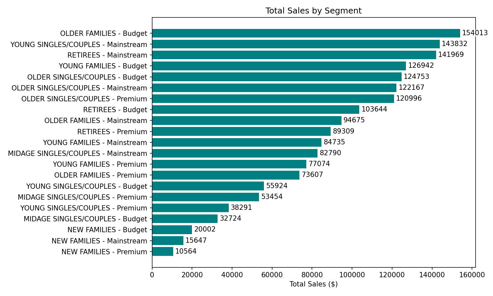

### Average spend per customer
#### Families are the most valuable chip customers, but not the biggest group - the current focus on total sales overlooks who actually drives value per customer.
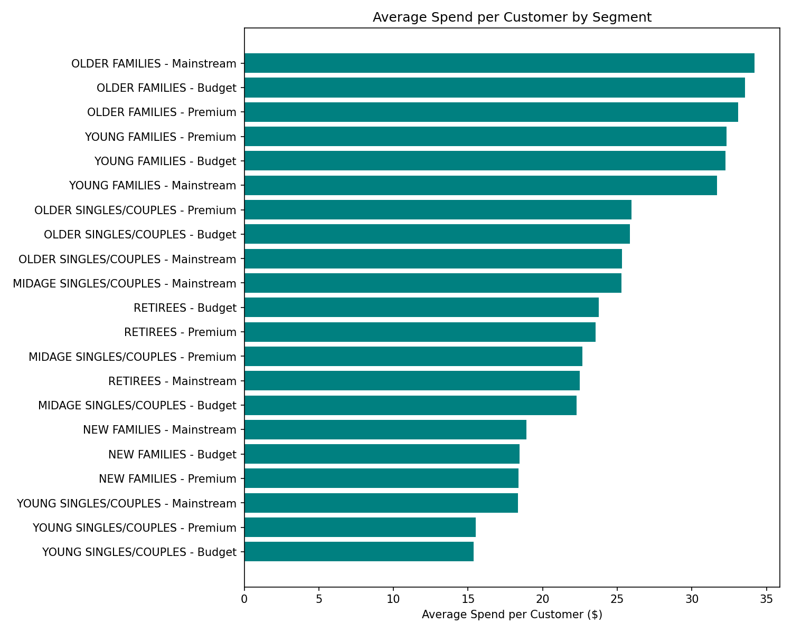

### Pack size mix
#### Its the small and the standard packs being sold more compared to larger packs
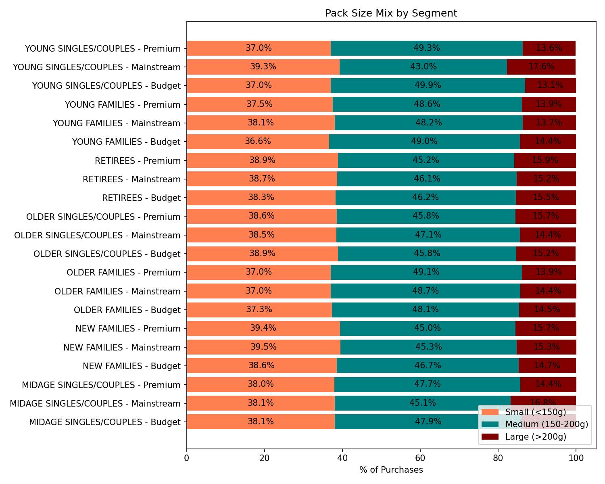

### Monthly sales trend
#### Sales peak sharply in Nov–Dec and drop in February.
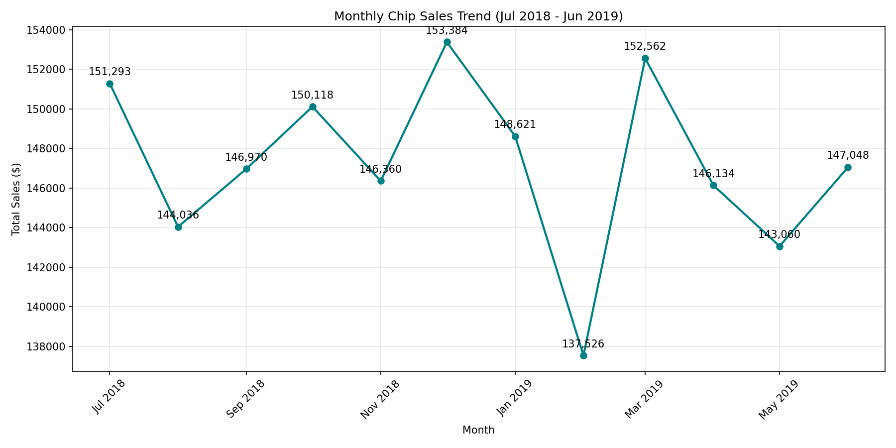

### Top brands - Sales v/s Count
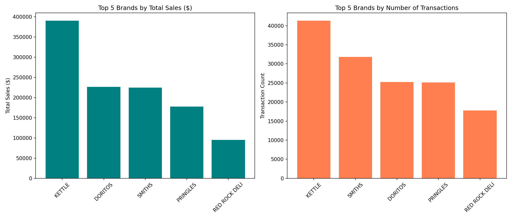

---
---

## Trial store analysis with Control store

Each trial store was matched to a control store with a near-identical pre-trial sales pattern, isolating the layout's true effect from normal seasonal variation

  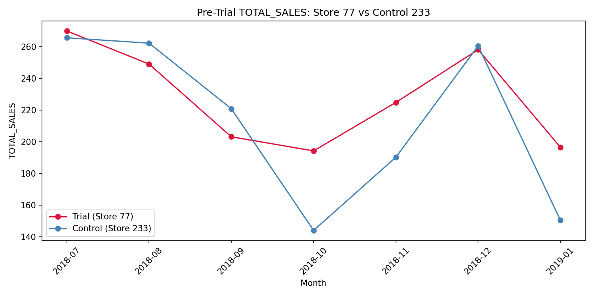
  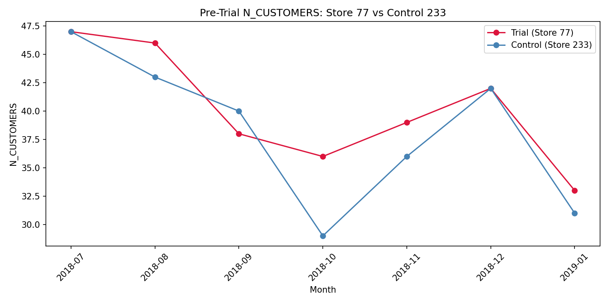

## Trial store configuration

| Parameter | Value |
|------------|---------|
| Trial Stores | 77, 86, 88 |
| Pre-Trial Period | Jul 2018 – Jan 2019 |
| Trial Period | Feb 2019 – Apr 2019 |
| Evaluation Metrics | Total Sales, Number of Customers |

## Analysis

#### Store 77 shows a significant, accelerating sales increase — successful trial.

  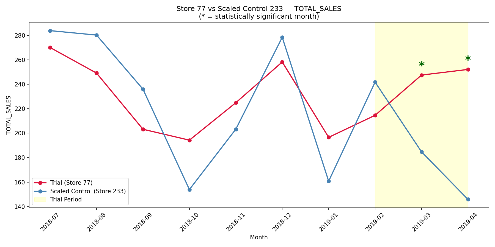
  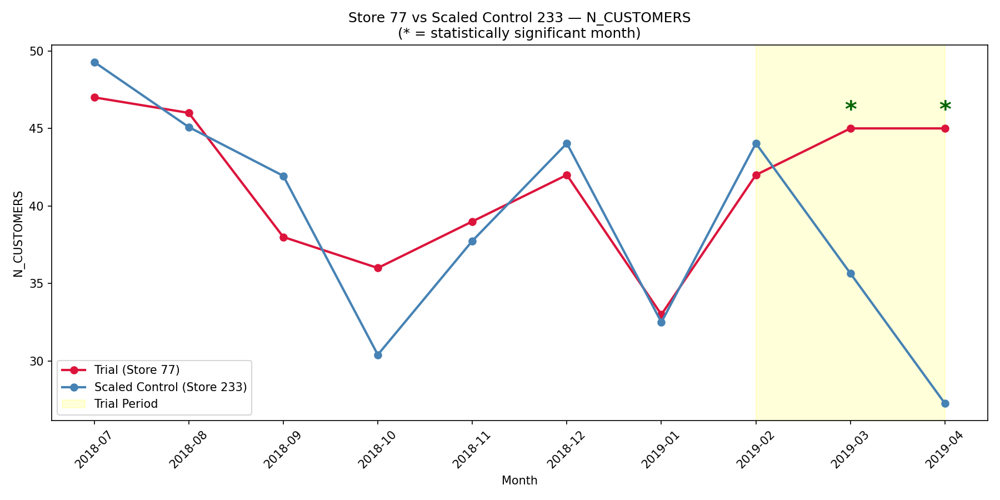

#### Store 86 shows a significant but single-month spike — partially successful, worth further investigation.

  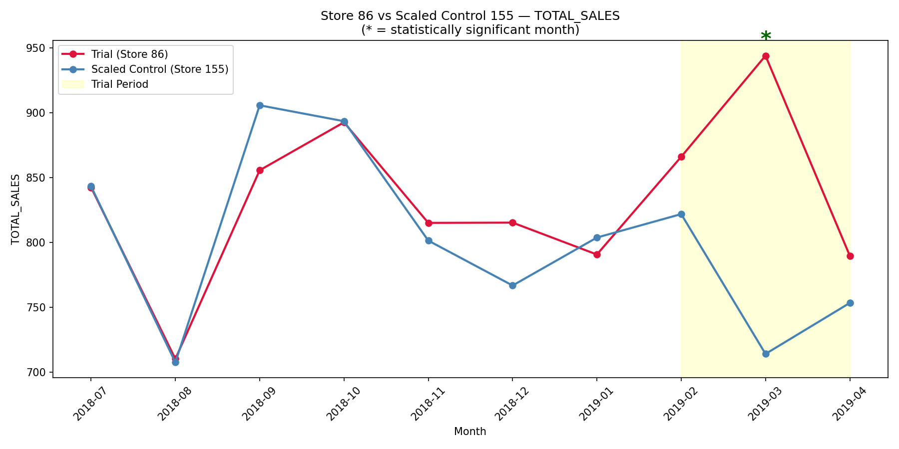
  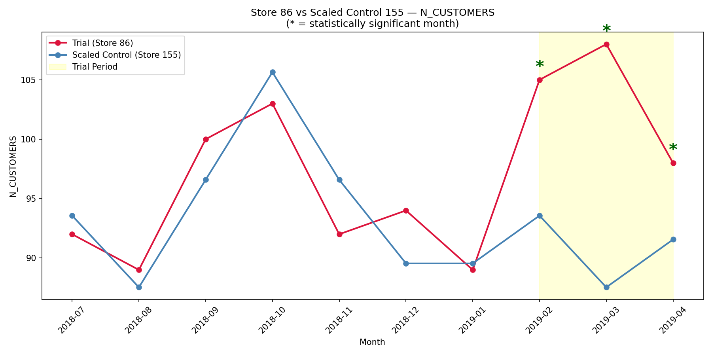

#### Store 88 shows early gains that fade by the final month — inconclusive, and its control match was weaker.

  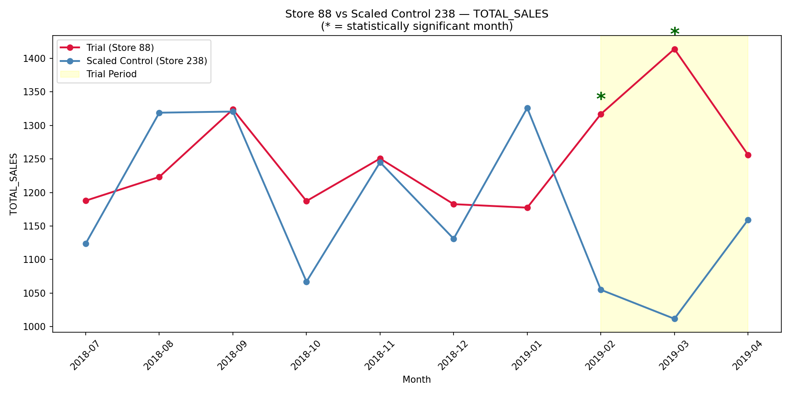
  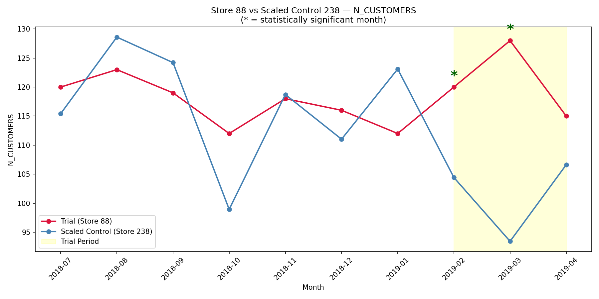

---
---

## Summary

Family segments (Older & Young Families) are the highest-value chip customers per person - driven by buying more often, not by price, pack size, or brand choice. Sales peak sharply in Nov–Dec and drop in February.

The trial layout drove a statistically significant sales increase in all 3 trial stores, primarily through more customers shopping - supporting a wider rollout, though Store 88's result warrants a closer look.
